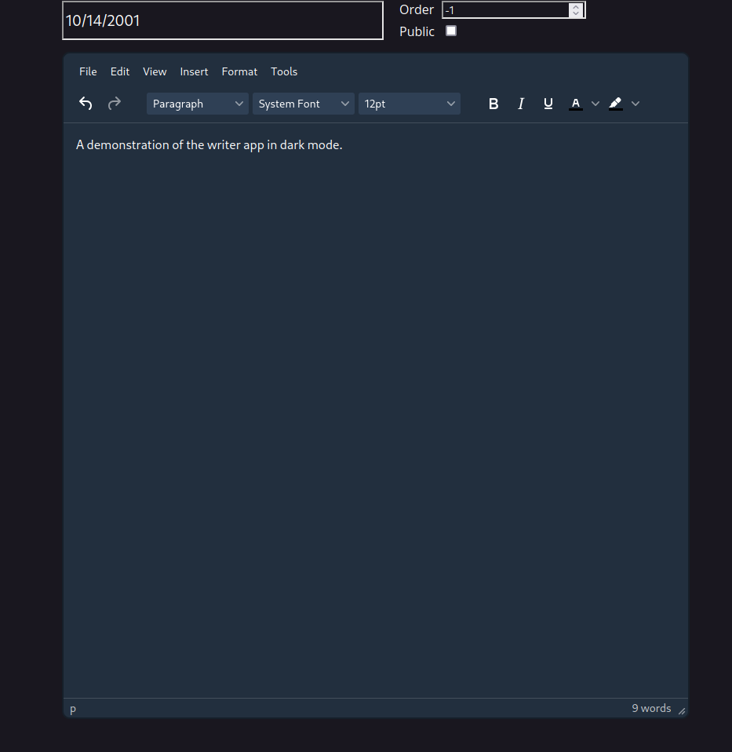
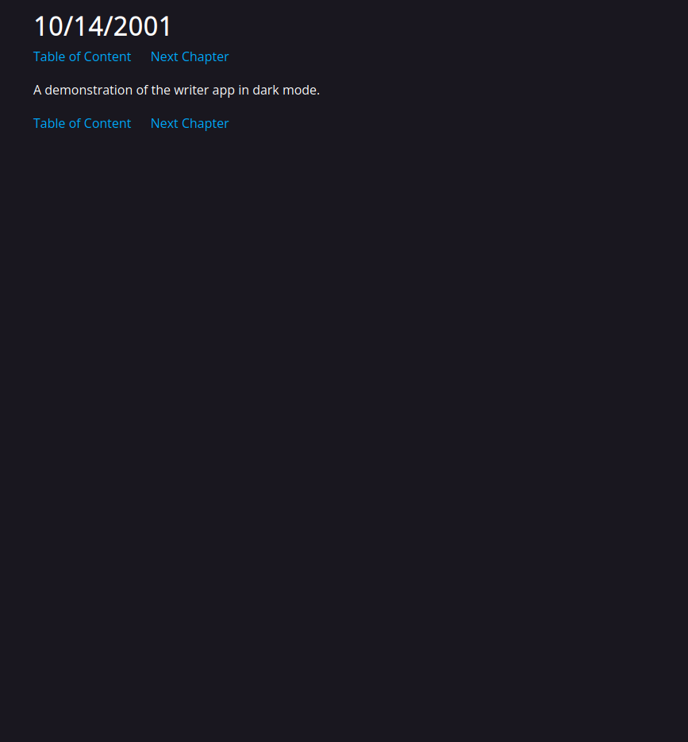

# Project
Page Word Processor is a web-based word processor with a very niche use case.



*A picture of what the writer mode looks like.*



*A picture of what the reader mode looks like.*

## Why?
As per new guidelines for my projects in 2024 all project must provide ample 
reason for existence.

This project's use case is for creating and managing any document that severely relies on paging.
This includes things such as

- Notes
- Book pages
- Blog post pages

What current software exist for such?

- OneNote
- Obsidian
- Word/Docs

Why not use one of the above instead of creating?

- Most do not think of each page as an individual document, and lack features for pages (e.g, word count per page)
- Clunky export integration pipeline (no CI/CD to publish to web)
- Peformance issues on those with individual pages. (not good for >300 pages)
- Closed-Source Software that may require payment and have a very undocumented extension API.

## Current Status
Currently in alpha. There may be security issues, and is not ready for public endpoints.

Unsecure.

- Createusers endpoint can be spammed to flood database and prevent normal users (needs a rate limit)
- Bucket and page endpoints can be flooded to waste storage (needs storage cap)
- Certain APIs may or may not be unsecure. None are documented, because any known would've been fixed, but be aware.

Other problems

- GUI is not in any good shape.
- Many skeletons in the API.
- Documententation of code subpar.
- Word spelling suggestions are very slow and freeze webpage (currently issue with Typo.js)

## Usage Notes

### 1. Setting up venv and dependencies

Navigate to the app directory and run:

```python -m venv .venv```

Then to activate it, run:

```source ./.venv/bin/activate```

Navigate back to the root directory and install required dependencies.

```pip install -r reqs.txt```

### 2. Environment Setup

To setup the environment, create a file called .env in the app directory. 
Here you will define 6 variables: password, user, url, dbtype, dbname, and tinymce_url. 
Specify variables on new lines like ```VAR_NAME="variable name"```

To setup tinymce_url, go to the website for tinymce and register for an account. After doing so,
find the url ending in *.min.js. Copy that link and set url to that.

For the application to work, make sure dbtype is set to "postgres"

Finally, register for a cloud-provider which provides a postgres database. When done, you will find a link 
to connect that looks something like this:
```postgresql://[DB USER]:[PASSWORD]@[URL]/[DatabaseName]```

Set these sections of the url accordingly in the .env.

### 3. Running

Either run run.sh or the command, 
```uvicorn app.main:app --host 0.0.0.0```

### 4. Post Setup

Navigate to the URL. It does not have a functional GUI to create users, so go to the URL/docs, and use the "Try It" button in the FastAPI docs. 
The app is now ready, but do note that to delete pages, buckets, or users, you must use SQL and execute it on the database.

Or manually post to /users/create api with a body user and password.

## Toolchain and framework
All new projects must have their toolchain and framework defined before the project starts.

If new tools need to be added during project, they must have a good reason.

- Python with FastAPI.
- Database with SQLite/PostgreSQL
- TinyMCE for frontend editing.
- Raw HTML on frontend
